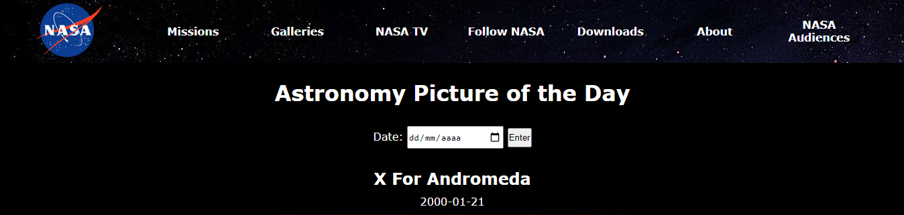

# 🪐 APOD NASA 🚀

📖 Aprendendo um pouco sobre requisição de API's

Projeto realizado com a utilização da biblioteca JavaScript - [jQuery](https://jquery.com/)

---

## 🌙 Introdução

A "Astronomy
Picture of the Day" (APOD) é uma API disponibilizada pela Nasa que fornece uma foto ou vídeo, diariamente, para que as pessoas
consigam descobrir um pouco mais sobre o espaço.

---

## 📝 Requisitos

✅ A aplicação deve ser capaz de receber uma data como entrada do usuário a partir de um input.

✅ Ao clicar no botão de envio, uma requisição deve ser enviada à API da APOD.

✅ Não existem requisitos quanto ao estilo da página. 🌟
